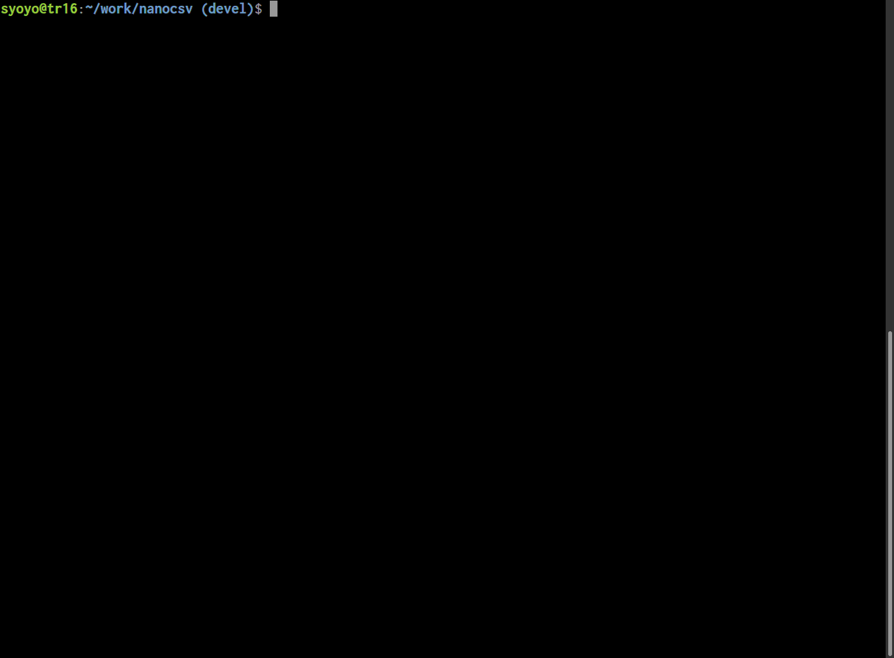

# NanoCSV, Faster C++11 multithreaded header-only CSV parser

NanoCSV is a fater C++11 multithreaded header-only CSV parser.




## Status

In development.
Currently CSV without no header(e.g. Tensor data saved by `numpy.savetxt`) are supported.

## Compiler options

* NANOCSV_NO_IO : Disable I/O(file access, stdio, mmap).

## TODO

* [ ] Reduce memory usage. Currently nanocsv allocates some memory for intermediate buffer.
* [ ] Robust error handling.
* [ ] Support header.
* [ ] Support different number of fields among records;
* [ ] Parse complex value(e.g. `3.0 + 4.2j`)
* [ ] Parse some special values, for example `#INF`, `#NAN`.
* [ ] CSV writer.
* [ ] Write tests.
* [ ] Remove libm(`pow`) dependency.

## Performance

Dataset is 8192 x 4096, 800 MB in file(generated by `tools/gencsv/gen.py`)

* Thradripper 1950X
* DDR4 2666 64 GB memory

### 1 thread.

```
total parsing time: 3833.33 ms
  line detection : 1264.99 ms
  alloc buf      : 0.016351 ms
  parse          : 2508.83 ms
  construct      : 55.726 ms
```

### 16 thread.

```
total parsing time: 545.646 ms
  line detection : 159.078 ms
  alloc buf      : 0.077979 ms
  parse          : 337.207 ms
  construct      : 46.7815 ms
```


### 23 threads

Since 23 threads are faster than 32 thread for 1950x.

```
total parsing time: 494.849 ms
  line detection : 127.176 ms
  alloc buf      : 0.050988 ms
  parse          : 314.287 ms
  construct      : 50.7568 ms
```

Roughly **7.7 times faster** than signle therad parsing.

### In python

Using `numpy.loadtxt` to load data takes 23.4 secs.

23 threaded naocsv parsing is Roughly **40 times faster** than `numpy.loadtxt`.

## References

* RFC 4180 https://www.ietf.org/rfc/rfc4180.txt

## License

MIT License

### Third-party license

* stack_container : Copyright (c) 2006-2008 The Chromium Authors. BSD-style license.

